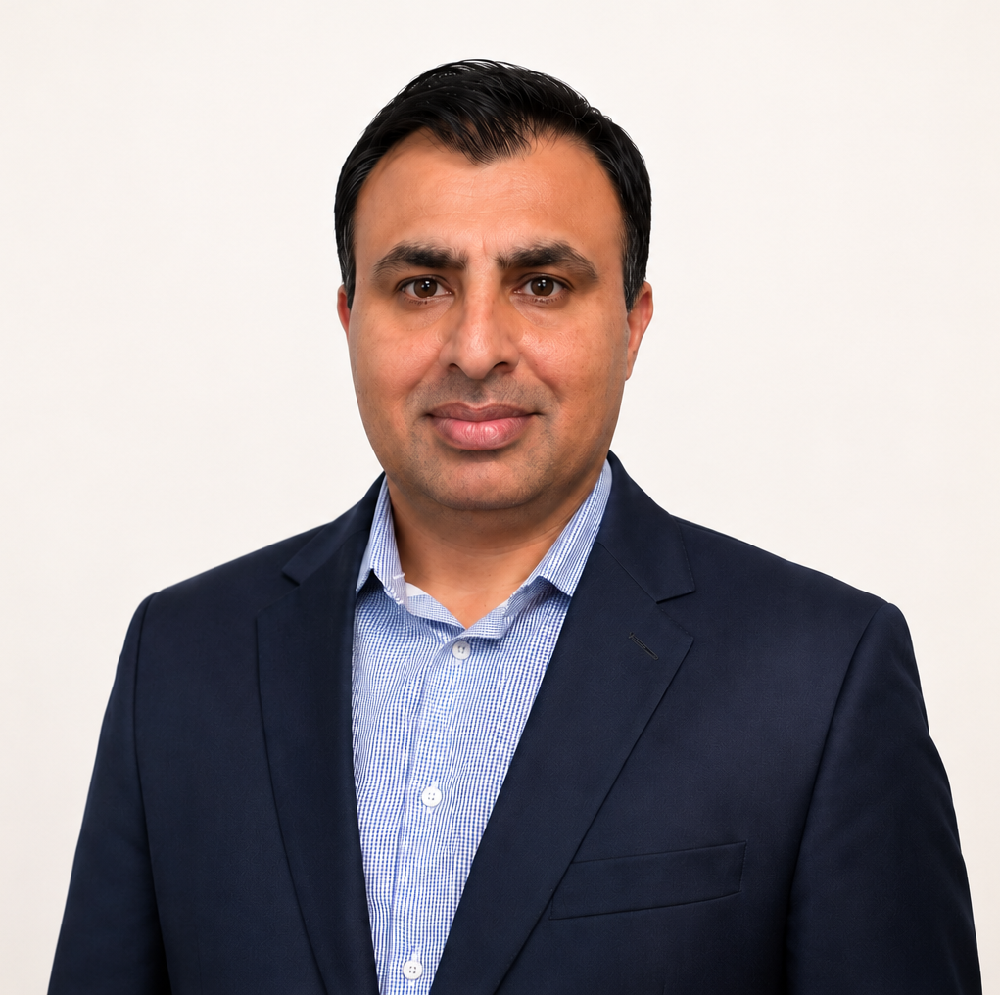

:::: {.columns}

::: {.column width="49%"}

:::

::: {.column width="5%"}
<!-- Blank -->
:::

::: {.column width="46%"}

<!-- I'm [Ed Rubin](bio.html), an associate professor in the [Department of Economics](https://economics.uoregon.edu) at the [University of Oregon](https://www.uoregon.edu). -->

[Hayatullah Ahmadzai]{style="font-size: 1.8em; color: #34495E; font-weight: 600;"}
 
[Agricultural Economist]{style="color: #3d4f63; font-weight: 500;"}

<!--
Academic CV Color Palette (saved options)

#1F4E79  - Academic Navy (US econ standard, safest choice)
#2C3E50  - Slate Blue-Gray (modern, clean, slightly softer navy)
#34495E  - Dark Blue-Gray (minimalist, neutral academic tone)
#3A6EA5  - Steel Blue (slightly more personality, still professional)
#222222  - Near Black (ultra conservative, print-safe)
#4CAF50  - Template Green (original default, tech/web feel)
#163729  - Forest Academic Green (your LaTeX-style deep green)
-->

My research investigates how climate shocks, agricultural and food policy, and market conditions affect farm and rural household outcomes and resilience, using applied econometrics, causal inference, and impact evaluation methods to support evidence-based policy and program design.

###  [Research Interests]{style="color: #34495E;"}: 
Agricultural & Food Policy • Climate Change, Adaptation, & Agricultural Resilience • Agribusiness & Farm Economics • Food Security, Rural Livelihoods & Agrifood Systems • Applied Econometrics and Impact Evaluation

Durham, NC, USA | External Research Fellow, CREDIT, University of Nottingham | MESA Global Academy Scholar (2025–2027), Middle East Studies Association. 
Email: hayatullah.ahmadzai1@nottingham.ac.uk

<!--
### about me

 I'm an environmental economist who researches how human behavior (individual and policy) affects social equity and the health of the natural world.

As an empiricist, I tackle these issues with a toolbox that draws from econometrics, statistics, and data science.

Examples from a few recent projects…
 ↳ [*unequal health impacts from glyphosate exposure*](https://www.pnas.org/doi/10.1073/pnas.2413013121)
 ↳ [*curiously missing data in air-quality monitors*](https://doi.org/10.1162/rest_a_01477)
 ↳ [*disparate wildfire smoke avoidance*](Papers/draft-smoke.pdf)
 ↳ [*a field experiment in customer-based gender bias*](https://www.journals.uchicago.edu/doi/abs/10.1086/733049)
 ↳ [*pitfalls of machine learning in a 2SLS framework*](https://doi.org/10.48550/arXiv.2505.13422)
 ↳ [*strategic location of coal-fueled power plants*](Papers/draft-plant-locations.pdf). -->

### [Contact]{style="color: #34495E;"}

ahmadzaihayat@outlook.com 
 
Durham, North Carolina, USA
  
[Google Scholar](https://scholar.google.com/citations?user=iTDaZLcAAAAJ&hl=en) | [LinkedIn](https://www.linkedin.com/in/ahmadzaihayat)

<!--
### me

*Passions:* [the](Gallery/20250101-IMG_4248.jpg){.lightbox} [ou](Gallery/20250215-IMG_5072){.lightbox}t[do](Gallery/20250827-IMG_0238.jpg){.lightbox}o[rs](Gallery/20240629-IMG_8522_jpg.jpg){.lightbox}, [bikes](Gallery/20241221-IMG_3497_jpg.jpg){.lightbox}, [good](Gallery/20241227-IMG_4034_jpg.jpg){.lightbox} [food](Gallery/20251102-IMG_0950.jpg){.lightbox}/[coffee](Gallery/20250731-IMG_9226.jpg){.lightbox}/[drink](Gallery/20250307-IMG_5581.jpg){.lightbox}[s](Gallery/20250328-IMG_6463.jpg){.lightbox}, [road](Gallery/20250628-IMG_7806.jpg){.lightbox} [trips](Gallery/20250628-IMG_7797.jpg){.lightbox} [beauty](Gallery/20250629-IMG_7900.jpg){.lightbox}/[photography](photos.html), data, and (most of all) [loving](Gallery/20240806-IMG_0409_jpg.jpg){.lightbox} [people](Gallery/20250726-IMG_9131.jpg){.lightbox}.

### more

A few other professional items… I
 ↳ *started [TWEEDS](https://tweeds.io) with [friends](https://tweeds.io/about/)*,
 ↳ *help run [OSWEET](https://edrub.in/osweet.html)*,
 ↳ *co-wrote a textbook,* [↳]{style="color: white;"} *[Data Science and Public Policy](https://link.springer.com/book/10.1007/978-3-030-71352-2)*.

Please look around or [contact me](contact.html). -->

:::

::::
